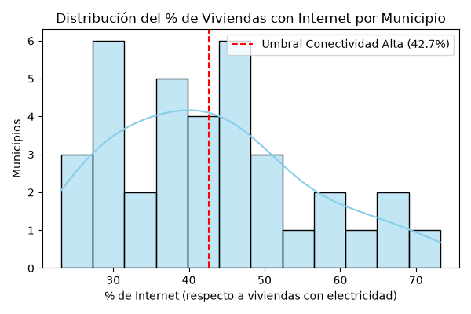
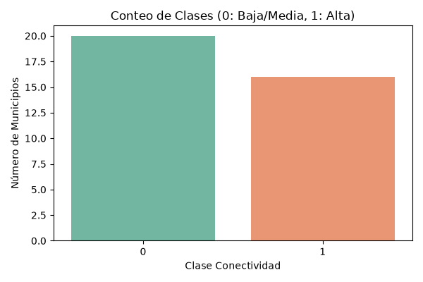

# Clasificación de municipios de Morelos según su nivel de conectividad a internet

**Autores:**
- Estefany Alexa Delgado Heredia
- Rocio Rodríguez Torres
- Antonio Garcia Gonzalez
- Diego Ricardo Amador Casillas

**Materia:** Extracción de conocimiento de Bases de Datos

**Institución:** UTEZ (Universidad Tecnológica de Emiliano Zapata) - Grupo 9A IDGS

---

## Resumen

Este artículo presenta un análisis de clasificación supervisada aplicado a los 36 municipios del estado de Morelos, México, para determinar si es posible identificar municipios de alta o baja conectividad a internet a partir del equipamiento tecnológico de sus viviendas. Se utilizaron datos públicos del INEGI (tabulado de Viviendas, Censo de Población y Vivienda 2020) agregados a nivel municipio. La variable objetivo compara el porcentaje de viviendas con internet de cada municipio contra el **promedio estatal** (~42.7%). Un `DecisionTreeClassifier` entrenado con los porcentajes de viviendas con computadora, TV de paga y celular alcanzó una exactitud de **0.9091** en el conjunto de prueba (10 de 11 municipios), donde la TV de paga resultó el predictor más relevante. El artículo documenta también las limitaciones del análisis, entre ellas el tamaño reducido de la muestra.

---

## 1. Introducción

La brecha digital afecta de manera desigual a los municipios de México: algunos cuentan con amplia cobertura de telecomunicaciones, mientras otros presentan carencias significativas de acceso a internet. En Morelos esta disparidad se manifiesta entre sus 36 municipios, y entender qué factores se asocian con un mayor o menor nivel de conectividad es relevante para orientar inversión pública en infraestructura.

La pregunta que guía este análisis es: **¿es posible clasificar a los municipios de Morelos como de "conectividad alta" o "conectividad baja" usando el porcentaje de viviendas con computadora, TV de paga y celular?** Para responderla se utilizó un enfoque de aprendizaje supervisado con datos oficiales del INEGI.

---

## 2. Fuente de datos

Los datos provienen del **Instituto Nacional de Estadística y Geografía (INEGI)**, del tabulado de Viviendas del Censo de Población y Vivienda 2020, filtrado al estado de Morelos. Se descargaron mediante **SCITEL** ([inegi.org.mx/app/scitel](https://www.inegi.org.mx/app/scitel/Default?ev=9)), la herramienta del INEGI que permite seleccionar variables e indicadores específicos en vez de descargar el tabulado completo del Censo.

El dataset original (`data/raw/dataset_original.csv`) contiene **1,678 registros a nivel localidad** y 11 variables: claves geográficas (entidad, municipio, localidad) y cinco indicadores de equipamiento en viviendas — electricidad (`VPH_C_ELEC`), internet (`VPH_INTER`), celular (`VPH_CEL`), TV de paga (`VPH_STVP`) y computadora (`VPH_PC`).

---

## 3. Preparación de datos

**Inspección inicial:** las cinco variables de equipamiento estaban almacenadas como tipo `object` en lugar de numérico, porque el INEGI marca con `*` las cifras confidenciales de localidades con menos de tres viviendas.

**Filtrado a nivel municipio:** el análisis se realiza a nivel municipio, no localidad, por lo que se conservaron únicamente las filas con `MUN > 0` y `LOC == 0`, que el INEGI reporta como "Total del Municipio". Esto redujo el dataset de 1,678 filas de localidad a **36 filas, una por municipio**.

**Limpieza:** las columnas con `*` se convirtieron a numérico (los asteriscos se vuelven `NaN`) y los `NaN` resultantes se imputaron con `0`, bajo la interpretación de que un valor confidencial representa equipamiento mínimo no cuantificado.

**Feature engineering:** se calcularon porcentajes respecto a las viviendas con electricidad (`VPH_C_ELEC`), en vez de usar conteos absolutos, ya que estos últimos reflejan el tamaño poblacional del municipio más que su conectividad relativa:

```
pct_internet = (VPH_INTER / VPH_C_ELEC) × 100
pct_pc       = (VPH_PC    / VPH_C_ELEC) × 100
pct_stvp     = (VPH_STVP  / VPH_C_ELEC) × 100
pct_cel      = (VPH_CEL   / VPH_C_ELEC) × 100
```

Cuando `VPH_C_ELEC` es cero se asignó `0` a cada porcentaje, para evitar divisiones por cero.

**Variable objetivo:** se creó la variable binaria `conectividad_alta` comparando cada municipio contra el **promedio estatal** de `pct_internet` sobre los 36 municipios (~42.65%), en vez de un umbral fijo elegido arbitrariamente: `1` (Alta) si `pct_internet >= promedio estatal`, `0` (Baja/Media) en otro caso. La distribución resultante fue **20 municipios (55.6%) Baja/Media** y **16 municipios (44.4%) Alta**.

---

## 4. Selección de variables

Se definieron como predictoras (`X`) los porcentajes de equipamiento `pct_pc` (computadora), `pct_stvp` (TV de paga) y `pct_cel` (celular). `pct_internet` se excluyó por haberse usado directamente para construir la variable objetivo (fuga de datos).

`NOM_MUN` (nombre del municipio) tampoco se usó como predictor: a nivel municipio cada fila corresponde a un municipio distinto, así que codificarlo equivaldría a darle al modelo un identificador único por observación — el árbol podría "memorizar" cada municipio del entrenamiento en vez de aprender un patrón generalizable.

---

## 5. Análisis exploratorio

El histograma de `pct_internet` para los 36 municipios, con el umbral de conectividad alta (~42.7%) marcado, muestra una concentración de municipios entre 25% y 50%, con una cola derecha que llega a poco más de 70%:



El conteo de la variable objetivo confirma un balance razonable entre clases (20 Baja/Media vs. 16 Alta), suficiente para entrenar el modelo sin técnicas de balanceo:



---

## 6. Metodología

Se utilizó un **Árbol de Decisión** (`DecisionTreeClassifier` de scikit-learn) por su interpretabilidad: permite identificar qué variables influyen más en la clasificación, algo especialmente útil con un conjunto de datos tan pequeño.

Configuración: profundidad máxima `max_depth = 4` (para evitar sobreajuste), criterio de división Gini, y `random_state = 42` para reproducibilidad. El dataset (36 municipios) se dividió en entrenamiento (70%, 25 municipios) y prueba (30%, 11 municipios), estratificando sobre la variable objetivo.

---

## 7. Resultados

El modelo produjo los siguientes resultados sobre el conjunto de prueba (11 municipios):

| Métrica        | Clase 0 (Baja/Media) | Clase 1 (Alta) | Macro avg | Promedio ponderado |
|---------------|:---------------------:|:---------------:|:---------:|:-------------------:|
| Precision     | 0.857                 | 1.000            | 0.929     | 0.922                |
| Recall        | 1.000                 | 0.800            | 0.900     | 0.909                |
| F1-Score      | 0.923                 | 0.889            | 0.906     | 0.908                |
| Support       | 6                      | 5                | 11        | 11                   |

**Exactitud global (Accuracy): 0.9091** (10 de 11 municipios correctamente clasificados). El único error fue un falso negativo: un municipio de conectividad alta real fue clasificado como baja/media. Con solo 11 municipios de prueba, cada caso representa cerca de 9 puntos porcentuales de la métrica, por lo que esta cifra debe leerse como señal de que las variables elegidas son informativas, no como una estimación precisa del desempeño del modelo.

Según `feature_importances_`, la variable con mayor peso predictivo fue **`pct_stvp`**, seguida de **`pct_pc`** y, en menor medida, **`pct_cel`**.

---

## 8. Interpretación

La disponibilidad de TV de paga (`pct_stvp`) es la variable con mayor peso dentro del árbol, seguida de la disponibilidad de computadoras (`pct_pc`). Esto sugiere que los municipios con mayor penetración de estos servicios tienden también a tener mayor acceso a internet, posiblemente porque los tres dependen de infraestructura de telecomunicaciones e ingreso disponible similares.

Este resultado debe interpretarse con cuidado: el modelo no demuestra causalidad. La disponibilidad de TV de paga o computadoras no necesariamente *causa* mayor conectividad; los tres indicadores podrían estar asociados con variables latentes como el nivel socioeconómico o la infraestructura de telecomunicaciones del municipio.

---

## 9. Limitaciones

1. **Muestra chica:** el análisis trabaja con solo 36 municipios, 11 de ellos en el conjunto de prueba. La exactitud reportada (0.9091) tiene varianza alta: cambiar la partición aleatoria (`random_state`) puede modificarla de forma notoria, ya que cada municipio de prueba representa cerca de 9 puntos porcentuales de la métrica.

2. **Datos agregados a nivel municipio:** al usar el total municipal (`LOC == 0`) se pierde la variación interna entre localidades; un municipio con localidades muy dispares en conectividad queda representado por un solo promedio.

3. **Datos de un periodo censal específico:** las cifras corresponden al Censo 2020 y no capturan cambios posteriores en la conectividad, como la expansión de infraestructura de telecomunicaciones ocurrida desde entonces.

4. **Variable faltante — ocupantes por vivienda:** el promedio de ocupantes por vivienda es un indicador socioeconómico que podría enriquecer el modelo, pero no está disponible en este tabulado del Censo 2020, por lo que se omitió en vez de aproximarlo con datos fuera del dataset.

5. **Confidencialidad de los datos base:** el INEGI marca con `*` las cifras de localidades individuales con menos de tres viviendas. Este análisis usa directamente los totales que el propio INEGI reporta por municipio (`LOC == 0`), donde no aparece ningún valor confidencial — el paso de imputación `* → 0` del código no llega a aplicarse aquí. Sin embargo, no es posible verificar con este tabulado si esos totales municipales incorporan por completo el equipamiento de las localidades pequeñas suprimidas, o si quedan subrepresentadas en el agregado.

6. **Umbral de la etiqueta:** `conectividad_alta` se define contra el promedio estatal de `pct_internet` (~42.7%), un criterio propio de este análisis que no representa un estándar oficial de conectividad definido por INEGI ni por ninguna otra fuente.

7. **El modelo no demuestra causalidad**, y simplifica un fenómeno socioeconómico complejo a solo tres variables de equipamiento del hogar, sin captar cobertura de red, costo del servicio o alfabetización digital.

8. **Generalización:** el análisis se limita a Morelos; los resultados no son generalizables a otros estados sin validación adicional.

---

## 10. Conclusiones

Los resultados sugieren que es posible clasificar municipios de Morelos según su nivel de conectividad a internet utilizando el porcentaje de viviendas con computadora, TV de paga y celular, con una exactitud de 0.9091 sobre un conjunto de prueba de 11 municipios. La disponibilidad de TV de paga y de computadoras resultaron los indicadores más fuertemente asociados con el acceso a internet a nivel municipio.

Dado el tamaño reducido de la muestra, este resultado debe leerse como evidencia de que las variables elegidas son informativas, no como una estimación robusta del desempeño del modelo. Este tipo de análisis podría servir como insumo exploratorio para focalizar inversión pública en telecomunicaciones, aunque requeriría complementarse con variables socioeconómicas, datos longitudinales y validación en campo antes de usarse en decisiones de política pública.

---

## 11. Referencias

1. Instituto Nacional de Estadística y Geografía (INEGI). Censo de Población y Vivienda 2020, vía SCITEL. Disponible en: [https://www.inegi.org.mx/app/scitel/Default?ev=9](https://www.inegi.org.mx/app/scitel/Default?ev=9)

2. scikit-learn. `DecisionTreeClassifier`. Documentación oficial. Disponible en: [https://scikit-learn.org/stable/modules/generated/sklearn.tree.DecisionTreeClassifier.html](https://scikit-learn.org/stable/modules/generated/sklearn.tree.DecisionTreeClassifier.html)
